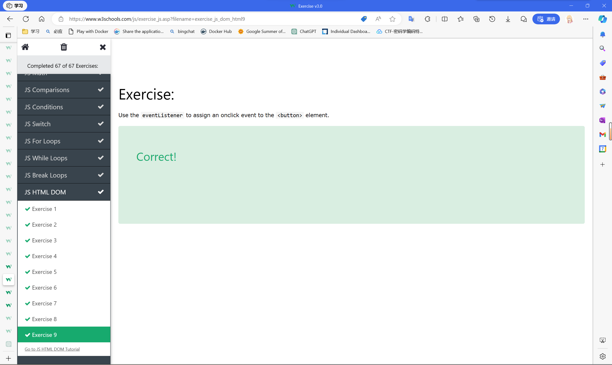
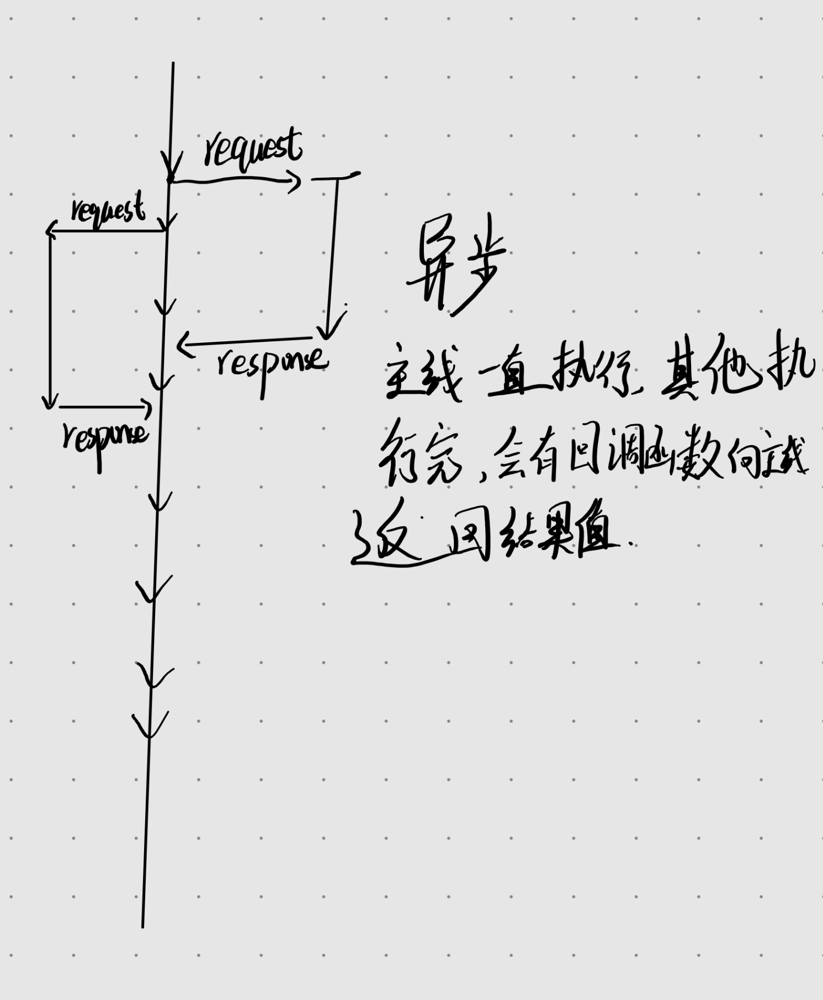

# 目录

- [x] 基础语法
因为有c++基础，上手快，挺简单。
- [x] 正则表达式
RegExp,还是只会在js的一些函数中去用/i/g等一些正则。
- [x] 基础知识通过
  
- [x] 异步编程了解
  
- [x] js的promise，throw，try，catch。
  真的是太爽了
- [x] nodejs核心概念
  以后使用的时候会对其印象更加深刻，例如事件驱动，单线程，尤其是异步和多并发
- [x] Express学习
  用它加chat做了一个简单的todo，但是只能添加，连个实时交互都做不到，可恶啊，还有删除也删不掉，可恶
- [x] 陷入迷茫了（2023-11-5）
- [ ] 开摆，摆上几天再说。

  